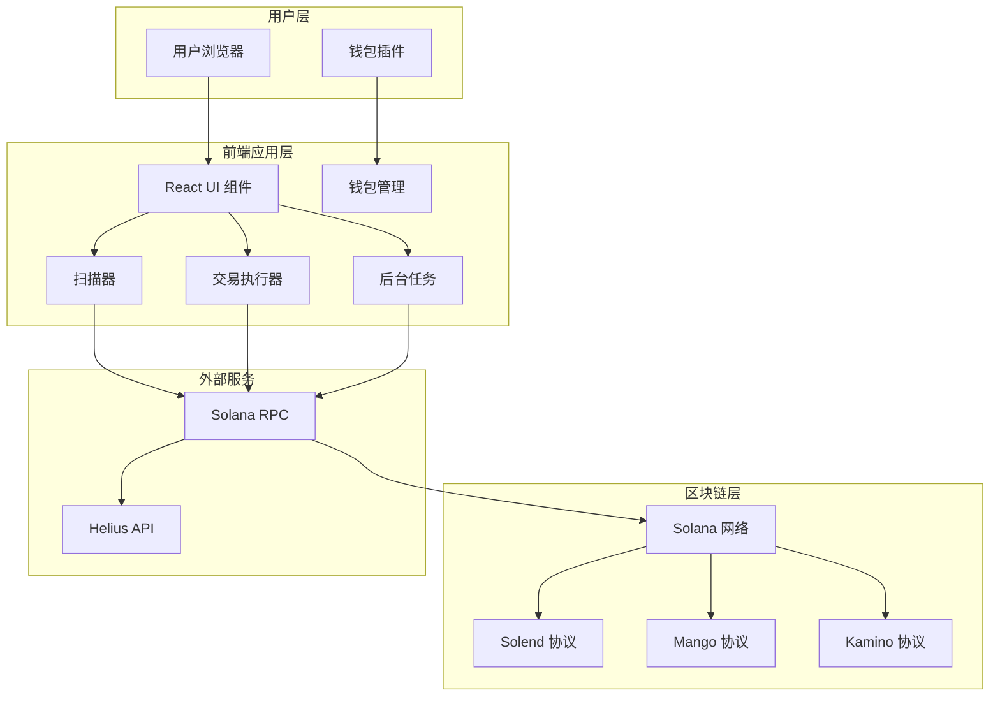

# 🏗️ 系统架构设计

## 📋 概述

Solana 清算机器人是一个完全基于前端的全功能 DeFi 应用，集成了清算机会扫描、钱包连接、交易执行等核心功能。

## 🎯 设计目标

- **完全前端化**: 无需独立服务器，降低部署成本
- **用户友好**: 直观的界面和操作流程
- **安全可靠**: 私钥安全，交易透明
- **功能完整**: 集成所有清算机器人功能
- **易于维护**: 单一项目，统一技术栈

## 🏛️ 整体架构



## 🧩 核心组件

### 1. 用户界面层 (UI Layer)
- **技术栈**: React 18 + Next.js 14 + TypeScript
- **样式**: TailwindCSS
- **组件**: 自定义组件 + 钱包适配器组件

**主要组件**:
- `EnhancedDashboard`: 主仪表板
- `StatsCard`: 统计卡片
- `AccountList`: 账户列表
- `WalletMultiButton`: 钱包连接按钮

### 2. 钱包管理层 (Wallet Management)
- **技术栈**: Solana Wallet Adapter
- **功能**: 钱包连接、交易签名、状态管理

**核心类**:
- `WalletContextProvider`: 钱包上下文提供者
- `LiquidationExecutor`: 清算执行器
- `FlashLoanExecutor`: 闪电贷执行器

### 3. 扫描器层 (Scanner Layer)
- **技术栈**: @solana/web3.js
- **功能**: 多协议清算机会扫描

**核心类**:
- `EnhancedLiquidationScanner`: 增强扫描器
- `SolendProtocol`: Solend 协议扫描
- `MangoProtocol`: Mango 协议扫描
- `KaminoProtocol`: Kamino 协议扫描

### 4. 后台任务层 (Background Tasks)
- **技术栈**: JavaScript 定时器 + 事件系统
- **功能**: 自动监控、定时扫描、机会通知

**核心类**:
- `BackgroundTaskManager`: 后台任务管理器
- `TaskConfig`: 任务配置
- `TaskStatus`: 任务状态

### 5. 数据层 (Data Layer)
- **技术栈**: 内存存储 + 本地状态
- **功能**: 数据缓存、状态管理

**数据结构**:
- `LiquidationOpportunity`: 清算机会
- `ScanResult`: 扫描结果
- `LiquidationResult`: 清算结果

## 🔄 数据流设计

### 1. 扫描流程
```
用户触发 → 扫描器初始化 → 连接 RPC → 获取账户数据 → 解析协议数据 → 计算健康因子 → 筛选机会 → 更新 UI
```

### 2. 交易流程
```
用户选择机会 → 钱包连接 → 构建交易 → 用户签名 → 发送交易 → 等待确认 → 更新结果
```

### 3. 监控流程
```
启动监控 → 定时扫描 → 发现机会 → 触发通知 → 更新缓存 → 刷新 UI
```

## 🔐 安全架构

### 1. 私钥安全
- **原则**: 私钥仅在用户钱包中，不传输到服务器
- **实现**: 使用 Solana Wallet Adapter
- **验证**: 所有交易需要用户手动确认

### 2. 交易安全
- **验证**: 交易前进行盈利性检查
- **限制**: 设置最大滑点和 Gas 限制
- **确认**: 等待交易确认后才更新状态

### 3. 网络安全
- **HTTPS**: 所有通信使用 HTTPS
- **CORS**: 配置适当的跨域策略
- **验证**: 输入数据验证和清理

## 📊 性能设计

### 1. 前端优化
- **代码分割**: 按需加载组件
- **缓存策略**: 合理使用浏览器缓存
- **虚拟化**: 大列表使用虚拟滚动

### 2. 网络优化
- **RPC 选择**: 使用高性能 RPC 节点
- **批量请求**: 合并多个 RPC 调用
- **重试机制**: 网络失败自动重试

### 3. 内存优化
- **数据清理**: 定期清理过期数据
- **限制大小**: 限制缓存数据大小
- **垃圾回收**: 及时释放不需要的对象

## 🔧 扩展性设计

### 1. 协议扩展
- **接口抽象**: 定义统一的协议接口
- **插件机制**: 支持动态加载新协议
- **配置驱动**: 通过配置文件添加新协议

### 2. 功能扩展
- **模块化**: 功能模块独立，便于扩展
- **事件系统**: 使用事件驱动架构
- **API 设计**: 提供扩展 API

### 3. 部署扩展
- **环境配置**: 支持多环境部署
- **水平扩展**: 支持多实例部署
- **监控集成**: 集成监控和日志系统

## 🎯 技术决策

### 1. 为什么选择前端架构？
- **成本低**: 无需服务器维护成本
- **部署简单**: Vercel 一键部署
- **用户体验**: 直接浏览器访问
- **安全性**: 私钥不离开用户设备

### 2. 为什么选择 Next.js？
- **全栈能力**: 支持 API Routes
- **性能优化**: 内置优化功能
- **开发体验**: 优秀的开发工具
- **生态丰富**: 丰富的插件生态

### 3. 为什么选择 Solana Wallet Adapter？
- **标准化**: 遵循 Solana 标准
- **兼容性**: 支持主流钱包
- **安全性**: 经过安全审计
- **维护性**: 官方维护更新

## 📈 监控指标

### 1. 性能指标
- **页面加载时间**: < 3 秒
- **扫描响应时间**: < 10 秒
- **交易确认时间**: < 30 秒

### 2. 业务指标
- **扫描成功率**: > 95%
- **交易成功率**: > 90%
- **用户活跃度**: 日活跃用户数

### 3. 错误指标
- **错误率**: < 1%
- **崩溃率**: < 0.1%
- **恢复时间**: < 5 分钟

---

**文档版本**: v2.0.0  
**最后更新**: 2025-01-29  
**审核状态**: ✅ 已审核
