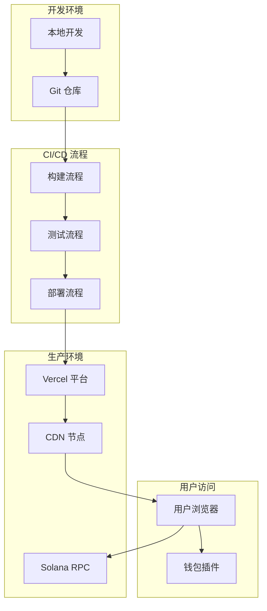

# 🚀 部署概览

## 📋 部署方案总览

Solana 清算机器人采用完全前端化的部署方案，支持多种部署平台和环境配置。

## 🎯 部署目标

- **零服务器**: 完全基于前端，无需独立服务器
- **自动部署**: 代码推送自动触发部署
- **全球加速**: 利用 CDN 实现全球访问
- **成本优化**: 最小化部署和运行成本
- **高可用**: 确保服务稳定可用

## 🏗️ 部署架构



## 🌐 部署平台

### 1. Vercel (推荐)
- **优势**: 零配置部署、全球 CDN、自动 HTTPS
- **成本**: 免费额度充足
- **性能**: 优秀的全球访问速度
- **集成**: 与 GitHub 深度集成

### 2. Netlify
- **优势**: 静态站点优化、表单处理
- **成本**: 免费额度充足
- **性能**: 良好的全球访问速度
- **集成**: 支持多种构建工具

### 3. GitHub Pages
- **优势**: 完全免费、与 GitHub 集成
- **成本**: 完全免费
- **性能**: 基础 CDN 支持
- **限制**: 仅支持静态内容

## 🔧 环境配置

### 1. 开发环境
```bash
# 环境变量
NEXT_PUBLIC_RPC_ENDPOINT=http://localhost:8899
NEXT_PUBLIC_NETWORK=devnet
NEXT_PUBLIC_DEBUG=true
```

### 2. 测试环境
```bash
# 环境变量
NEXT_PUBLIC_RPC_ENDPOINT=https://api.testnet.solana.com
NEXT_PUBLIC_NETWORK=testnet
NEXT_PUBLIC_DEBUG=true
```

### 3. 生产环境
```bash
# 环境变量
NEXT_PUBLIC_RPC_ENDPOINT=https://api.mainnet-beta.solana.com
NEXT_PUBLIC_NETWORK=mainnet
NEXT_PUBLIC_DEBUG=false
NEXT_PUBLIC_HELIUS_API_KEY=your-api-key
```

## 📦 构建配置

### 1. Next.js 配置
```javascript
// next.config.js
/** @type {import('next').NextConfig} */
const nextConfig = {
  output: 'export',
  trailingSlash: true,
  images: {
    unoptimized: true,
  },
  env: {
    NEXT_PUBLIC_RPC_ENDPOINT: process.env.NEXT_PUBLIC_RPC_ENDPOINT,
    NEXT_PUBLIC_NETWORK: process.env.NEXT_PUBLIC_NETWORK,
  },
};

module.exports = nextConfig;
```

### 2. Vercel 配置
```json
{
  "buildCommand": "npm run build",
  "outputDirectory": ".next",
  "framework": "nextjs",
  "installCommand": "npm install",
  "functions": {
    "app/api/liquidation/route.ts": {
      "maxDuration": 30
    }
  },
  "env": {
    "NEXT_PUBLIC_RPC_ENDPOINT": "https://api.mainnet-beta.solana.com"
  }
}
```

### 3. 构建脚本
```json
{
  "scripts": {
    "build": "next build",
    "build:analyze": "ANALYZE=true next build",
    "build:production": "NODE_ENV=production next build",
    "export": "next export",
    "deploy": "vercel --prod"
  }
}
```

## 🚀 部署流程

### 1. 自动部署 (推荐)
```yaml
# .github/workflows/deploy.yml
name: Deploy to Vercel
on:
  push:
    branches: [main]
  pull_request:
    branches: [main]

jobs:
  deploy:
    runs-on: ubuntu-latest
    steps:
      - uses: actions/checkout@v3
      - uses: actions/setup-node@v3
        with:
          node-version: '18'
      - run: npm ci
      - run: npm run build
      - run: npm run test
      - uses: amondnet/vercel-action@v20
        with:
          vercel-token: ${{ secrets.VERCEL_TOKEN }}
          vercel-org-id: ${{ secrets.ORG_ID }}
          vercel-project-id: ${{ secrets.PROJECT_ID }}
          vercel-args: '--prod'
```

### 2. 手动部署
```bash
# 安装 Vercel CLI
npm install -g vercel

# 登录 Vercel
vercel login

# 部署到预览环境
vercel

# 部署到生产环境
vercel --prod
```

### 3. 本地构建部署
```bash
# 构建项目
npm run build

# 导出静态文件
npm run export

# 部署到静态托管
# 将 out 目录上传到托管平台
```

## 🔐 安全配置

### 1. HTTPS 配置
- **自动 HTTPS**: Vercel 自动配置 SSL 证书
- **强制 HTTPS**: 重定向 HTTP 到 HTTPS
- **HSTS**: 启用 HTTP 严格传输安全

### 2. 安全头配置
```javascript
// next.config.js
const securityHeaders = [
  {
    key: 'X-DNS-Prefetch-Control',
    value: 'on'
  },
  {
    key: 'Strict-Transport-Security',
    value: 'max-age=63072000; includeSubDomains; preload'
  },
  {
    key: 'X-Frame-Options',
    value: 'DENY'
  },
  {
    key: 'X-Content-Type-Options',
    value: 'nosniff'
  },
  {
    key: 'Referrer-Policy',
    value: 'origin-when-cross-origin'
  }
];
```

### 3. 环境变量安全
- **敏感信息**: 使用环境变量存储
- **访问控制**: 限制环境变量访问权限
- **加密存储**: 敏感信息加密存储

## 📊 监控配置

### 1. 性能监控
```javascript
// 集成 Vercel Analytics
import { Analytics } from '@vercel/analytics/react';

export default function App() {
  return (
    <>
      <YourApp />
      <Analytics />
    </>
  );
}
```

### 2. 错误监控
```javascript
// 集成 Sentry
import * as Sentry from '@sentry/nextjs';

Sentry.init({
  dsn: process.env.NEXT_PUBLIC_SENTRY_DSN,
  environment: process.env.NODE_ENV,
});
```

### 3. 业务监控
```typescript
// 自定义监控指标
export const trackEvent = (event: string, data: any) => {
  if (typeof window !== 'undefined') {
    // 发送到分析服务
    analytics.track(event, data);
  }
};
```

## 🔄 回滚策略

### 1. 自动回滚
- **健康检查**: 部署后自动健康检查
- **错误率监控**: 监控错误率变化
- **自动回滚**: 错误率过高时自动回滚

### 2. 手动回滚
```bash
# 回滚到上一个版本
vercel rollback

# 回滚到指定版本
vercel rollback <deployment-url>
```

### 3. 蓝绿部署
- **蓝环境**: 当前生产环境
- **绿环境**: 新版本环境
- **切换**: 验证通过后切换流量

## 📈 性能优化

### 1. 构建优化
- **代码分割**: 按需加载代码
- **Tree Shaking**: 移除未使用代码
- **压缩优化**: 压缩 JS 和 CSS
- **图片优化**: 自动图片优化

### 2. 运行时优化
- **CDN 加速**: 静态资源 CDN 分发
- **缓存策略**: 合理设置缓存策略
- **预加载**: 关键资源预加载
- **懒加载**: 非关键资源懒加载

### 3. 网络优化
- **HTTP/2**: 支持 HTTP/2 协议
- **Gzip 压缩**: 启用 Gzip 压缩
- **Brotli 压缩**: 支持 Brotli 压缩
- **资源合并**: 合并小文件请求

## 🎯 部署检查清单

### 部署前检查
- [ ] 代码已通过所有测试
- [ ] 构建无错误和警告
- [ ] 环境变量配置正确
- [ ] 安全配置已启用
- [ ] 监控配置已添加

### 部署后检查
- [ ] 网站可正常访问
- [ ] 所有功能正常工作
- [ ] 性能指标正常
- [ ] 错误监控正常
- [ ] 用户反馈收集

## 📚 相关文档

- [Vercel 部署指南](vercel.md)
- [环境配置指南](environment.md)
- [监控运维指南](monitoring.md)
- [故障排除指南](../user-guide/troubleshooting.md)

---

**文档版本**: v2.0.0  
**最后更新**: 2025-01-29  
**审核状态**: ✅ 已审核
